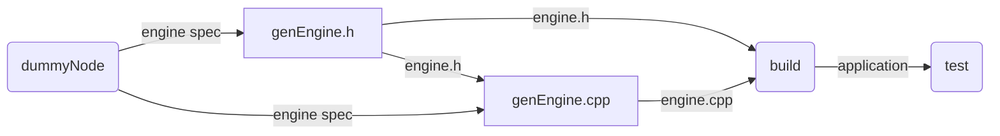

# FoldFlow

A DAG-based project workflow engine for managing complex project workflows.

## Overview

FoldFlow is a console application that helps manage project workflows using Directed Acyclic Graphs (DAGs). It supports two types of nodes:

- **Prompt Nodes**: Prompt an LLM with text and skill resources
- **Execute Nodes**: Execute shell commands

Resources flow between nodes and can be of three types:

- **Text**: Code, prompts, or any text content
- **Skills**: Tools together with a SKILL.md file
- **Artifacts**: Files like performance recordings

## Installation

```bash
pip install -e .
```

## Usage

### Initialize a project

```bash
foldflow init
```

### Add nodes

```bash
# Add an execute node
foldflow add-node --type execute --name build --command "make build"

# Add a prompt node
foldflow add-node --type prompt --name "generate-code" --prompt "Generate code for..."
```

### Add dependencies

```bash
foldflow add-edge <from_node_id> <to_node_id> --resource-name engine.h --resource-type text
```

### List nodes

```bash
foldflow list-nodes
```

### Show fold structure

```bash
foldflow show-fold
```

### Execute a sprint

```bash
# Just resolve nodes
foldflow sprint

# Run complete cycle (resolve + edit fold)
foldflow sprint --cycle
```

## Example Fold Structure



In this example:
- Execute nodes have round edges
- Prompt nodes have hard edges
- Resources are labeled on the edges

## Sprint Structure

A sprint consists of two steps:

1. **Resolve**: Nodes are resolved in bottom-up order (dependencies first). If a node fails, all nodes further up cannot be executed.
2. **Edit**: An LLM equipped with tools to read node data and edit the fold modifies the fold for the next sprint.

## Project Structure

A FoldFlow project is a git repository with a `fold.json` file that stores the fold structure.
