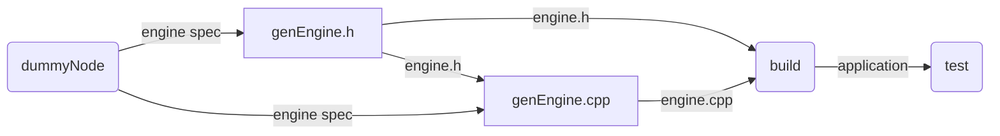

# FoldFlow specification
## Definitions
### resource
A resource is an atomic unit of stuff passed between nodes. It is important that the creation of a resource can be attributed to one and only one node.
FoldFlow supports three kinds of resources:
- text (for instance code or a prompt)
- skills (a set of tools together with a SKILL.md as present in many coding agents such as opencode)
- artifacts (for instance a perf recording)
### Node
A node is a unit of work. It consumes some resources and emits other resources. A node does not modify the resources it consumes, only the ones it emits. It can be thought of as a pure function. Resolving a node means finishing the work associated with the node.
FoldFlow supports two kinds of nodes:
- prompt (prompts a llm)
- execute (executes an arbitrary shell command)
### Fold
A fold is a directed acyclic graph of nodes. It represents the entirity of a projects structure and encodes all the steps required to modify, build and test the project in the next sprint. 
To go through one sprint, all nodes in the fold must be resolved successfully.
### project
A project is a git repository equipped with a file that stores its fold.

## prompt nodes
Prompt nodes represent a prompt to an llm. 
To resolve a prompt node, the prompt must be built, the llm prompted with said prompt and the skills consumed by the node. The prompt is built from the text resources and SKILL.md files contained in the skill resource, they are simply concatenated together in order text, skills.
A prompt node is resolved successfully if and only if the llm finishes its response. The response is saved in the node for future use.
## exceute nodes
An execute node represents the execution of an arbitrary shell command.
To resolve an execute node, said shell command must be executed. Working directory is the project root.
An execute node is resolved successfully if and only if the command runs completely and without errors.
The output of the command is saved in the node for future use.
## Example fold structure
Execute nodes have round edges while prompt nodes have hard edges. The resources passed between nodes are labeled on the edges.

## structure of a sprint
A sprint consists of two steps.
First, the nodes of the Fold are resolved in bottom up order, as far as possible (some may fail to resolve). If node fails to resolve, all nodes further up in the fold from that node cannot be executed. Some nodes may have already been resolved during a previous sprint.
Next, an llm equipped with tools to read the data stored in nodes and edit the fold is tasked with editing the fold such that the next sprint is more successful.
The cycle repeats.
## Implementation
FoldFlow is a console application made with python. It supports commands for hand crafting fold structure and doing one sprint.
